# Benefit Eligibility App ERD

```mermaid
erDiagram
    LANGUAGES {
        text code PK
        text name
    }

    USERS {
        uuid id PK
        citext email UK
        text phone UK
        text preferred_language FK
        user_role role
        uuid auth_user_id FK
        timestamptz created_at
    }

    ROLES {
        uuid id PK
        text name UK
        text description
    }

    PERMISSIONS {
        uuid id PK
        text name UK
        text description
    }

    USER_ROLES {
        uuid user_id FK
        uuid role_id FK
    }

    ROLE_PERMISSIONS {
        uuid role_id FK
        uuid permission_id FK
    }

    USER_SESSIONS {
        uuid id PK
        uuid user_id FK
        text refresh_token_hash
        inet ip_address
        text user_agent
        timestamptz expires_at
        timestamptz revoked_at
        timestamptz created_at
    }

    SCREENING_SESSIONS {
        uuid id PK
        uuid user_id FK
        text preferred_language FK
        int current_step
        timestamptz completed_at
        timestamptz expires_at
        inet ip_address
        text user_agent
        text fingerprint_hash
        timestamptz created_at
        timestamptz updated_at
    }

    RESUME_TOKENS {
        uuid id PK
        uuid session_id FK
        auth_channel channel
        text destination
        text token_hash
        timestamptz expires_at
        timestamptz used_at
        timestamptz created_at
    }

    QUESTIONS {
        uuid id PK
        text question_key UK
        text answer_type
        int display_order
        boolean is_required
        jsonb branching_config
        timestamptz created_at
    }

    QUESTION_TRANSLATIONS {
        uuid question_id FK
        text language_code FK
        text prompt
        text helper_text
    }

    ANSWER_OPTIONS {
        uuid id PK
        uuid question_id FK
        text option_key
        jsonb value
        int display_order
    }

    ANSWER_OPTION_TRANSLATIONS {
        uuid option_id FK
        text language_code FK
        text label
    }

    QUESTION_DEPENDENCIES {
        uuid id PK
        uuid question_id FK
        uuid depends_on_question_id FK
        jsonb condition_json
    }

    SCREENING_ANSWERS {
        uuid id PK
        uuid session_id FK
        uuid question_id FK
        jsonb answer_value
        timestamptz created_at
        timestamptz updated_at
    }

    PROGRAMS {
        uuid id PK
        text program_key UK
        text category
        text authoritative_url
        boolean is_active
        timestamptz created_at
    }

    PROGRAM_TRANSLATIONS {
        uuid program_id FK
        text language_code FK
        text name
        text short_description
        text next_steps
    }

    ELIGIBILITY_RULE_VERSIONS {
        uuid id PK
        uuid program_id FK
        int version
        jsonb rules_json
        boolean false_positive_bias
        date effective_from
        date effective_to
        uuid created_by FK
        timestamptz created_at
    }

    ELIGIBILITY_RESULTS {
        uuid id PK
        uuid session_id FK
        uuid program_id FK
        uuid rule_version_id FK
        eligibility_outcome outcome
        int priority_rank
        jsonb explanation
        timestamptz created_at
    }

    DOCUMENT_TYPES {
        uuid id PK
        text doc_key UK
        text category
    }

    DOCUMENT_TYPE_TRANSLATIONS {
        uuid document_type_id FK
        text language_code FK
        text name
        text description
        text examples
    }

    PROGRAM_DOCUMENT_REQUIREMENTS {
        uuid id PK
        uuid program_id FK
        uuid document_type_id FK
        jsonb condition_json
        boolean is_required
    }

    SESSION_DOCUMENT_CHECKLIST {
        uuid id PK
        uuid session_id FK
        uuid program_id FK
        uuid document_type_id FK
        jsonb reason
        timestamptz created_at
    }

    DOCUMENT_UPLOADS {
        uuid id PK
        uuid session_id FK
        uuid document_type_id FK
        uuid predicted_document_type_id FK
        numeric classification_confidence
        classification_source classified_by
        timestamptz classified_at
        text file_name
        text file_mime_type
        text storage_url
        upload_status status
        text ocr_text
        timestamptz created_at
    }

    DOCUMENT_CLASSIFICATIONS {
        uuid id PK
        uuid document_upload_id FK
        uuid document_type_id FK
        numeric confidence
        classification_source classified_by
        text model_name
        uuid corrected_by_user_id FK
        jsonb raw_response
        timestamptz created_at
    }

    KNOWLEDGE_SOURCES {
        uuid id PK
        uuid program_id FK
        text title
        text source_url
        text language_code FK
        text content_text
        timestamptz created_at
    }

    SEARCH_EMBEDDINGS {
        uuid id PK
        search_target_type target_type
        uuid target_id
        text language_code FK
        text content_text
        vector embedding
        text embedding_model
        timestamptz created_at
    }

    SEARCH_SYNONYMS {
        uuid id PK
        text language_code FK
        text term
        text[] synonyms
        timestamptz created_at
    }

    SEARCH_QUERIES {
        uuid id PK
        uuid session_id FK
        uuid user_id FK
        text query_text
        text language_code FK
        int result_count
        search_target_type selected_target_type
        uuid selected_target_id
        timestamptz created_at
    }

    AI_CONVERSATIONS {
        uuid id PK
        uuid session_id FK
        uuid user_id FK
        text language_code FK
        boolean human_handoff_requested
        timestamptz created_at
    }

    AI_MESSAGES {
        uuid id PK
        uuid conversation_id FK
        text role
        text content
        jsonb citations
        timestamptz created_at
    }

    AI_RECOMMENDATIONS {
        uuid id PK
        uuid session_id FK
        uuid user_id FK
        recommendation_target_type target_type
        uuid target_id
        text rationale
        numeric score
        text model_name
        recommendation_status status
        timestamptz viewed_at
        timestamptz accepted_at
        timestamptz dismissed_at
        timestamptz created_at
    }

    NOTIFICATION_PREFERENCES {
        uuid id PK
        uuid session_id FK
        uuid user_id FK
        notification_channel channel
        text destination
        text language_code FK
        notification_frequency frequency
        boolean opted_in
        timestamptz created_at
    }

    NOTIFICATION_EVENTS {
        uuid id PK
        text event_type
        jsonb payload
        timestamptz created_at
    }

    NOTIFICATION_DELIVERIES {
        uuid id PK
        uuid notification_event_id FK
        uuid user_id FK
        notification_channel channel
        notification_delivery_status delivery_status
        text provider_message_id
        timestamptz delivered_at
        timestamptz created_at
    }

    ORGANIZATIONS {
        uuid id PK
        text name
        text organization_type
        text phone
        citext email
        text website_url
        jsonb address
        text[] service_categories
        timestamptz created_at
    }

    REFERRALS {
        uuid id PK
        uuid session_id FK
        uuid organization_id FK
        text need_category
        referral_status status
        text notes
        timestamptz sent_at
        timestamptz created_at
    }

    LIFE_EVENTS {
        uuid id PK
        text event_key UK
    }

    LIFE_EVENT_TRANSLATIONS {
        uuid life_event_id FK
        text language_code FK
        text label
    }

    PROGRAM_LIFE_EVENTS {
        uuid program_id FK
        uuid life_event_id FK
    }

    ADDRESSES {
        uuid id PK
        uuid session_id FK
        uuid user_id FK
        text raw_input
        jsonb normalized_address
        text verification_provider
        text verification_status
        timestamptz created_at
    }

    NAVIGATOR_CLIENTS {
        uuid navigator_user_id FK
        uuid client_user_id FK
        timestamptz consent_granted_at
        timestamptz consent_revoked_at
    }

    CASES {
        uuid id PK
        uuid session_id FK
        uuid assigned_to FK
        case_status status
        case_priority priority
        timestamptz created_at
        timestamptz updated_at
    }

    CASE_NOTES {
        uuid id PK
        uuid case_id FK
        uuid author_id FK
        text note
        boolean is_internal
        timestamptz created_at
    }

    BENEFIT_ESTIMATES {
        uuid id PK
        uuid session_id FK
        uuid program_id FK
        numeric min_amount
        numeric max_amount
        text period
        text disclaimer
        jsonb calculation_details
        timestamptz created_at
    }

    AUTH_USER {
        uuid id PK
        text name
        text email UK
        timestamptz emailVerified
        text image
    }

    AUDIT_LOGS {
        uuid id PK
        uuid actor_user_id FK
        uuid session_id FK
        text action
        text entity_type
        uuid entity_id
        jsonb before_value
        jsonb after_value
        inet ip_address
        text user_agent
        timestamptz created_at
    }

    ANOMALY_FLAGS {
        uuid id PK
        uuid session_id FK
        uuid user_id FK
        anomaly_flag_type flag_type
        anomaly_severity severity
        anomaly_status status
        text detector
        jsonb payload
        uuid reviewed_by FK
        timestamptz reviewed_at
        text review_notes
        timestamptz created_at
    }

    LANGUAGES ||--o{ USERS : preferred_language
    LANGUAGES ||--o{ SCREENING_SESSIONS : preferred_language
    LANGUAGES ||--o{ QUESTION_TRANSLATIONS : translates
    LANGUAGES ||--o{ ANSWER_OPTION_TRANSLATIONS : translates
    LANGUAGES ||--o{ PROGRAM_TRANSLATIONS : translates
    LANGUAGES ||--o{ DOCUMENT_TYPE_TRANSLATIONS : translates
    LANGUAGES ||--o{ KNOWLEDGE_SOURCES : language
    LANGUAGES ||--o{ AI_CONVERSATIONS : language
    LANGUAGES ||--o{ NOTIFICATION_PREFERENCES : language
    LANGUAGES ||--o{ LIFE_EVENT_TRANSLATIONS : translates
    LANGUAGES ||--o{ SEARCH_EMBEDDINGS : language
    LANGUAGES ||--o{ SEARCH_SYNONYMS : language
    LANGUAGES ||--o{ SEARCH_QUERIES : language

    AUTH_USER ||--o| USERS : auth_identity
    USERS ||--o{ USER_SESSIONS : has
    USERS ||--o{ USER_ROLES : has
    ROLES ||--o{ USER_ROLES : assigned
    ROLES ||--o{ ROLE_PERMISSIONS : grants
    PERMISSIONS ||--o{ ROLE_PERMISSIONS : included

    USERS ||--o{ SCREENING_SESSIONS : owns_optional
    SCREENING_SESSIONS ||--o{ RESUME_TOKENS : resumes
    SCREENING_SESSIONS ||--o{ SCREENING_ANSWERS : has
    QUESTIONS ||--o{ SCREENING_ANSWERS : answered_by
    QUESTIONS ||--o{ QUESTION_TRANSLATIONS : has
    QUESTIONS ||--o{ ANSWER_OPTIONS : has
    ANSWER_OPTIONS ||--o{ ANSWER_OPTION_TRANSLATIONS : has
    QUESTIONS ||--o{ QUESTION_DEPENDENCIES : target
    QUESTIONS ||--o{ QUESTION_DEPENDENCIES : dependency

    PROGRAMS ||--o{ PROGRAM_TRANSLATIONS : has
    PROGRAMS ||--o{ ELIGIBILITY_RULE_VERSIONS : has
    USERS ||--o{ ELIGIBILITY_RULE_VERSIONS : created
    SCREENING_SESSIONS ||--o{ ELIGIBILITY_RESULTS : produces
    PROGRAMS ||--o{ ELIGIBILITY_RESULTS : evaluated_for
    ELIGIBILITY_RULE_VERSIONS ||--o{ ELIGIBILITY_RESULTS : used_by

    DOCUMENT_TYPES ||--o{ DOCUMENT_TYPE_TRANSLATIONS : has
    PROGRAMS ||--o{ PROGRAM_DOCUMENT_REQUIREMENTS : requires
    DOCUMENT_TYPES ||--o{ PROGRAM_DOCUMENT_REQUIREMENTS : required_as
    SCREENING_SESSIONS ||--o{ SESSION_DOCUMENT_CHECKLIST : generates
    PROGRAMS ||--o{ SESSION_DOCUMENT_CHECKLIST : for_program
    DOCUMENT_TYPES ||--o{ SESSION_DOCUMENT_CHECKLIST : checklist_item
    SCREENING_SESSIONS ||--o{ DOCUMENT_UPLOADS : uploads
    DOCUMENT_TYPES ||--o{ DOCUMENT_UPLOADS : classifies
    DOCUMENT_TYPES ||--o{ DOCUMENT_UPLOADS : predicts
    DOCUMENT_UPLOADS ||--o{ DOCUMENT_CLASSIFICATIONS : history
    DOCUMENT_TYPES ||--o{ DOCUMENT_CLASSIFICATIONS : labels
    USERS ||--o{ DOCUMENT_CLASSIFICATIONS : corrects

    PROGRAMS ||--o{ KNOWLEDGE_SOURCES : cites
    SCREENING_SESSIONS ||--o{ AI_CONVERSATIONS : has
    USERS ||--o{ AI_CONVERSATIONS : starts_optional
    AI_CONVERSATIONS ||--o{ AI_MESSAGES : contains

    SCREENING_SESSIONS ||--o{ NOTIFICATION_PREFERENCES : has
    USERS ||--o{ NOTIFICATION_PREFERENCES : owns
    NOTIFICATION_EVENTS ||--o{ NOTIFICATION_DELIVERIES : triggers
    USERS ||--o{ NOTIFICATION_DELIVERIES : receives

    SCREENING_SESSIONS ||--o{ REFERRALS : creates
    ORGANIZATIONS ||--o{ REFERRALS : receives

    PROGRAMS ||--o{ PROGRAM_LIFE_EVENTS : tagged
    LIFE_EVENTS ||--o{ PROGRAM_LIFE_EVENTS : maps
    LIFE_EVENTS ||--o{ LIFE_EVENT_TRANSLATIONS : has

    SCREENING_SESSIONS ||--o{ ADDRESSES : has
    USERS ||--o{ ADDRESSES : owns_optional

    USERS ||--o{ NAVIGATOR_CLIENTS : navigator
    USERS ||--o{ NAVIGATOR_CLIENTS : client

    SCREENING_SESSIONS ||--o{ CASES : opens
    USERS ||--o{ CASES : assigned
    CASES ||--o{ CASE_NOTES : has
    USERS ||--o{ CASE_NOTES : authors

    SCREENING_SESSIONS ||--o{ BENEFIT_ESTIMATES : has
    PROGRAMS ||--o{ BENEFIT_ESTIMATES : estimated_for

    USERS ||--o{ AUDIT_LOGS : actor
    SCREENING_SESSIONS ||--o{ AUDIT_LOGS : related_session

    SCREENING_SESSIONS ||--o{ SEARCH_QUERIES : initiates
    USERS ||--o{ SEARCH_QUERIES : initiates

    SCREENING_SESSIONS ||--o{ AI_RECOMMENDATIONS : receives
    USERS ||--o{ AI_RECOMMENDATIONS : receives_optional

    SCREENING_SESSIONS ||--o{ ANOMALY_FLAGS : flagged_session
    USERS ||--o{ ANOMALY_FLAGS : flagged_user
    USERS ||--o{ ANOMALY_FLAGS : reviewer
```

## Notes

- Screening can be anonymous because `screening_sessions.user_id` is nullable. `screening_sessions.fingerprint_hash` (plus `ip_address` / `user_agent`) is the input for duplicate-submission detection in `anomaly_flags`.
- `users.auth_user_id` is a unique FK to the NextAuth `User` table. Optional accounts (story 4) are linked through this column rather than via business-logic-only matching on email.
- `referrals.organization_id` is nullable so a session can record a request for in-person help (story 11) before an organization is assigned.
- Eligibility determinations are deterministic through `eligibility_rule_versions`; AI tables are separate from rule execution.
- Multilingual content is modeled through translation tables linked to `languages`.
- Document uploads support OCR as assistive metadata only through `ocr_text`. AI-predicted document type is stored alongside the confirmed type (`predicted_document_type_id`, `classification_confidence`, `classified_by`); `document_classifications` keeps the full history of AI predictions and user corrections.
- `search_embeddings` is polymorphic over `programs` and `knowledge_sources` (target_type + target_id, no FK); it requires the pgvector extension and an HNSW index applied via raw SQL migration.
- `ai_recommendations` is polymorphic over `programs`, `organizations`, and `knowledge_sources`. `status` lets the UI track viewed/accepted/dismissed without deleting rows.
- `anomaly_flags` are advisory: the schema never blocks a user based on a flag. Admins review through the `status` workflow.
- Audit logs are append-only in practice and should be written by backend services, not directly by public API clients.
